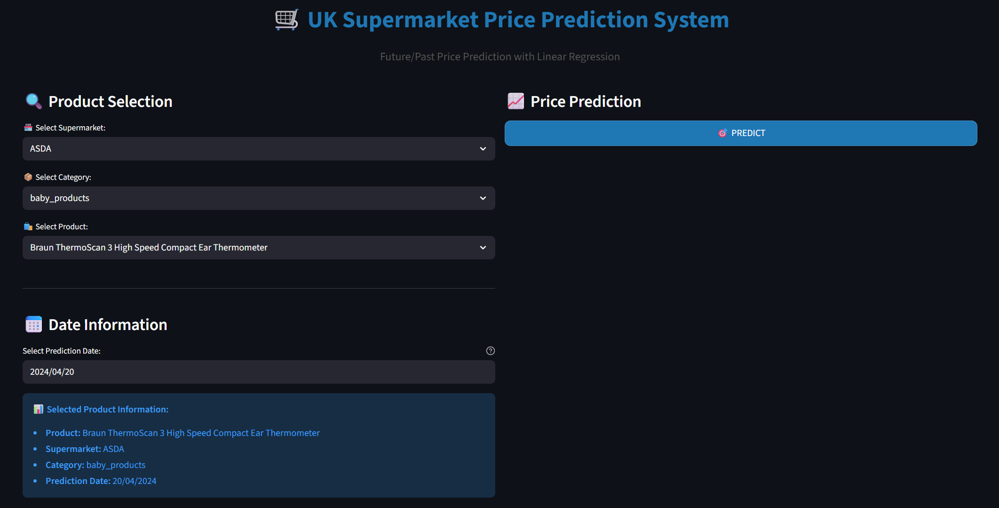

# Customer Segmentation and Price Prediction

End-to-end data science project analyzing UK supermarket data with machine learning models and an interactive web interface.

---

## 🔎 Project Description

This project performs:

✅ Customer/product segmentation using **K-Means Clustering**  
✅ Price prediction using **Linear Regression**  
✅ Shopping basket optimization simulation  
✅ Web interface using **Streamlit**  

It demonstrates a complete data science workflow: data preprocessing, modeling, evaluation, and an interactive UI for predictions.

---

## 🧠 Machine Learning Models

### 📊 Price Prediction
- Model: **Linear Regression**
- High performance with R² ≈ **99.86%**
- Predicts future prices based on historical data.

### 🧩 Customer/Product Segmentation
- Algorithm: **K-Means Clustering**
- Clusters products into similar groups for basket optimization and analysis.

---

## 🖥 Web Application Preview

### Product Selection

---

### Price Prediction Result

---

### Basket Optimization View

---

## 🛠 Technologies Used

### Languages & Libraries
- Python  
- Pandas  
- NumPy  
- Scikit-Learn  
- Matplotlib  
- Seaborn

### Web / UI
- Streamlit  
- HTML & CSS  
- React (UI components)

### Databases
- PostgreSQL  
- MySQL

---

## 🗂 Project Structure

customer-segmentation-and-price-prediction/
│
├── notebooks/
├── models/
├── screenshots/
├── basket_optimizer_app.py
├── requirements.txt
└── README.md

---

## ⚙️ Installation

Clone the repository:

git clone https://github.com/ibrahimvural08/customer-segmentation-and-price-prediction.git
Install dependencies:

pip install -r requirements.txt

Run the Streamlit app:

streamlit run basket_optimizer_app.py

---

## 📁 Dataset

The dataset contains UK supermarket prices from January to April 2024, including product and category price history.

---

## 👨‍💻 Developer

**İbrahim Vural**  
📧 ibrahimvur08@gmail.com  
🔗 https://www.linkedin.com/in/ibrahim-vural-51362229a/

